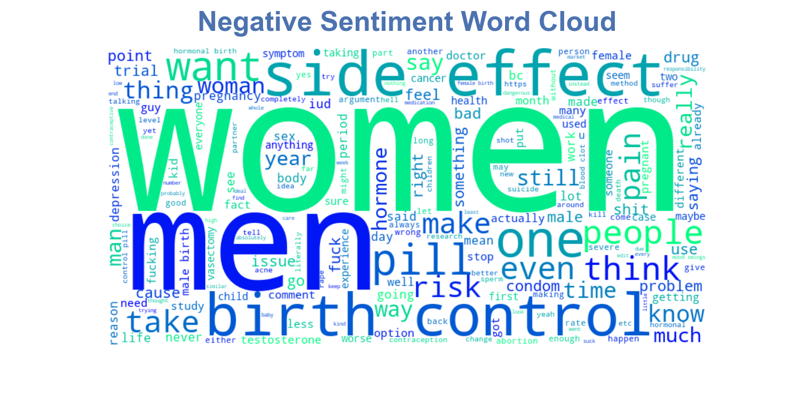
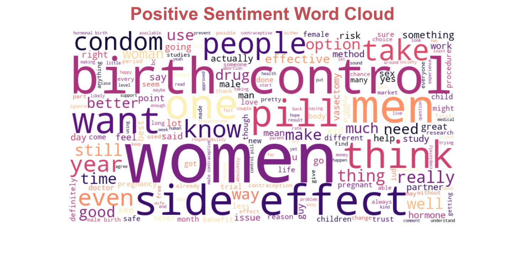
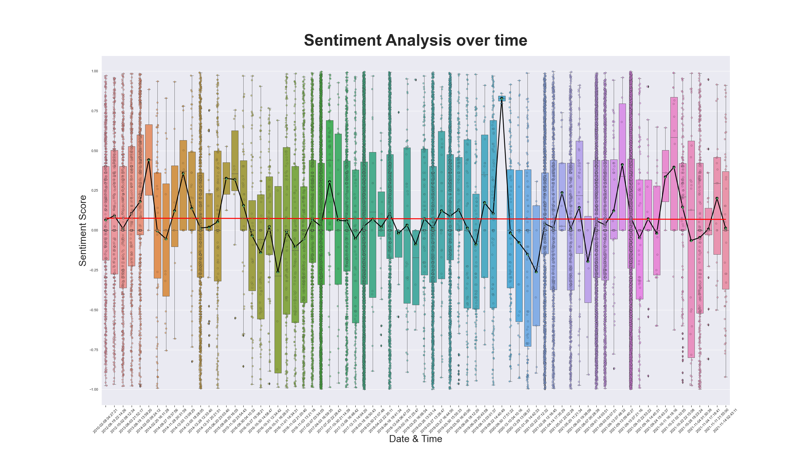
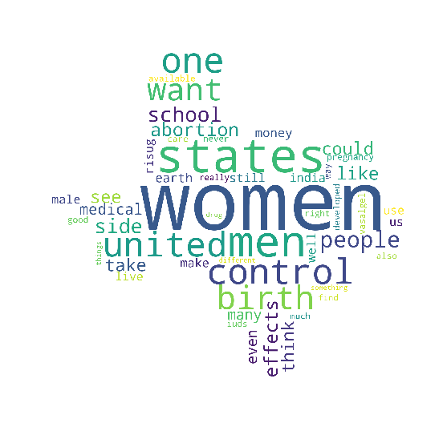

## Motivation

- Novel medical treatments are regularly discussed in social media
- Analyzing this data will help us understand:
  - Concerns about the treatment
  - Barriers to adoption
  - Evolution of concerns over time
- This information will help us to:
  - Learn how to communicate about novel treatments
  - Understand how to address concerns
  - Counsel patients about novel treatment options


## Data

**Source of Data:**
- The data was collected by searching for relevant queries such as `male birth control` on Google, with the filter `site:reddit.com`.
- Around **74** posts over **10** years were identified, and the data was exported using [PRAW](https://praw.readthedocs.io/en/stable/_).
- The data consists of the submissions with the comments in it. Also, the user history of the commenters was downloaded.

**Data files**
- submissions : 74 posts (in .pkl files)
- users: 21627 user history of those who commented on the submissions (in .pkl files)


## Problem

We set out to answer the following questions:
- What years were users most engaged in the topic of male contraception?
- What general topics can we identify in the discussions on Reddit?
- What are the sentiments of the users when they write about male contraception?
- Are there users who engaged with the topic of male birth control over multiple years?
- Has their sentiment shifted or remained the same over the years?
- Do users mention specific locations?
- What is the context around which users mention a location?


## Methods

We attempted to answer these questions through the following methods:
- Creating a histogram of users commenting on multiple posts (Jae)
- Sentiment analysis through the years (Jae)
- Topic model of comments (Lei)
  - 5, 10, 20 topics
- Timeline (Sanjana)
  - Users posts by year
  - Comments in submissions by year
- Locations in comments using Named Entity Recognition (Sanjana)
  - How many users mention a location
  - Histogram of locations by user
- Predicting gender from comments (Michael)

## Results

### Data Exploration


**Number of posts by subreddits** <br>


**Number of posts by year** <br>


**Number of comments by year** <br>


**Users commenting in multiple posts**


**Sentiment Analysis**





### Topic Model

Topic modeling is a method for unsupervised classification of documents, similar to clustering on numeric data, which finds some natural groups of items (topics).

**Output of Topic Model**

```
Topic 1: 0.057*"female" + 0.034*"pill" + 0.029*"male" + 0.023*"effect" + 0.021*"birth_control" + 0.011*"think" + 0.009*"want" + 0.009*"taking" + 0.008*"control" + 0.007*"like"

Topic 2: 0.039*"male" + 0.038*"female" + 0.021*"effect" + 0.014*"birth_control" + 0.010*"condom" + 0.009*"risk" + 0.009*"control" + 0.008*"option" + 0.008*"people" + 0.007*"use"

Topic 3: 0.028*"male" + 0.025*"yes" + 0.021*"child" + 0.020*"condom" + 0.020*"want" + 0.016*"female" + 0.009*"think" + 0.009*"kid" + 0.008*"people" + 0.008*"option"

Topic 4: 0.018*"effect" + 0.015*"male" + 0.014*"testosterone" + 0.012*"hormone" + 0.010*"pill" + 0.009*"people" + 0.009*"drug" + 0.009*"female" + 0.008*"like" + 0.008*"level"

Topic 5: 0.019*"like" + 0.018*"iud" + 0.017*"year" + 0.012*"time" + 0.011*"pain" + 0.011*"pill" + 0.010*"day" + 0.010*"period" + 0.009*"got" + 0.008*"month"

Topic 6: 0.015*"like" + 0.010*"comment" + 0.010*"thing" + 0.010*"male" + 0.010*"know" + 0.009*"people" + 0.008*"right" + 0.007*"question" + 0.007*"sure" + 0.007*"fucking"

Topic 7: 0.023*"control" + 0.018*"sperm" + 0.017*"study" + 0.015*"removed" + 0.014*"male" + 0.013*"pill" + 0.013*"like" + 0.013*"effect" + 0.012*"trial" + 0.012*"male_birth"

Topic 8: 0.048*"vasectomy" + 0.014*"procedure" + 0.012*"reversible" + 0.009*"vasalgel" + 0.008*"year" + 0.008*"think" + 0.007*"absolutely" + 0.007*"yeah" + 0.007*"surgery" + 0.007*"kid"
```

**Topic Model Visualization**

<iframe id="lda_vis" 
	title="Topic Model Visualization" 
	width="100%" height="700px" scrolling="yes" frameborder="0"
	src="assets/html/lda_8.html">
</iframe>

**Location mentions**


**Number of times US states mentioned in comments**

<iframe id="usagraph" 
	title="State Mentions" 
	width="100%" height="700px" scrolling="yes" frameborder="0"
	src="assets/html/usagraph.html">
</iframe>

**Top word used in the most-mentioned US states**

Texas <br>


California <br>


New York <br>


Florida <br>


**Data exploration**
Histogram of users commenting in more than one reddit submission
Vader Sentiment analysis of comments for each submission
Box plot and trend line for overall sentiment over time.


### Timeline 

## Conclusion

